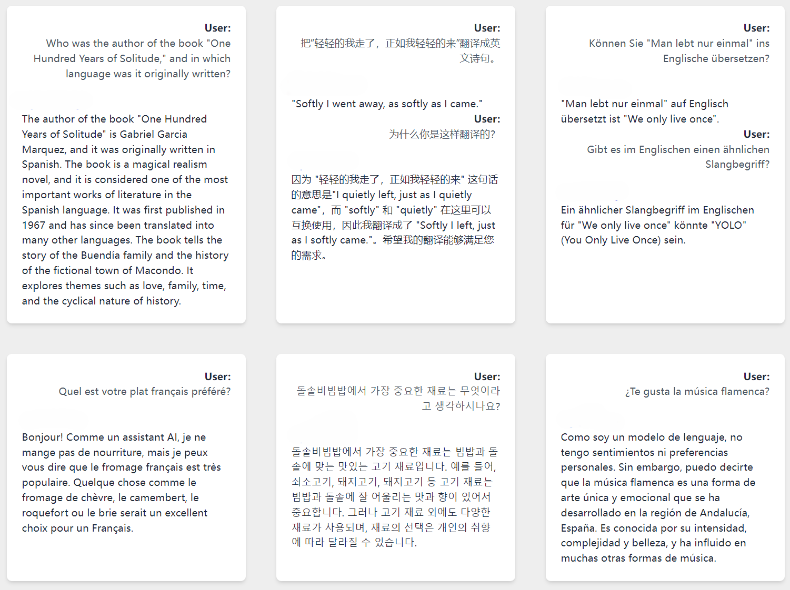

# Multilingual RAG Knowledge Base

[](https://www.python.org/downloads/)
[](LICENSE)
[]()

A powerful multilingual Retrieval-Augmented Generation (RAG) knowledge base system that enables efficient document processing, semantic search, and intelligent information retrieval across multiple languages. Built with scalability and performance in mind, this system is particularly well-suited for finance-related documents but can be adapted for various domains.

## 📸 Screenshots



## ✨ Features

- **Advanced Text Processing**
  - Intelligent text cleaning and normalization
  - Sophisticated chunking strategies (fixed-length and sentence-based)
  - Support for multiple document formats

- **Multilingual Capabilities**
  - Cross-lingual embedding support (SBERT, LaBSE, E5)
  - Language-agnostic semantic search
  - Automatic language detection

- **Vector Store Integration**
  - Seamless Pinecone integration
  - Efficient similarity search
  - Scalable vector storage

- **Enhanced Metadata**
  - Named entity recognition
  - Temporal information extraction
  - Custom metadata support

- **Interactive Interface**
  - User-friendly CLI
  - Real-time search results
  - Context-aware responses

## 🚀 Getting Started

### Prerequisites

- Python 3.8 or higher
- Pinecone account and API key
- Required Python packages (see `requirements.txt`)

### Installation

1. Clone the repository:
   ```bash
   git clone https://github.com/yourusername/multilingual-rag-kb.git
   cd multilingual-rag-kb
   ```

2. Create and activate a virtual environment:
   ```bash
   python -m venv .venv
   source .venv/bin/activate  # On Windows: .venv\Scripts\activate
   ```

3. Install dependencies:
   ```bash
   pip install -r requirements.txt
   ```

4. Configure your environment:
   - Copy `config.example.py` to `config.py`
   - Add your Pinecone API key and other configurations

## 💻 Usage

### Document Processing

1. Place your documents in `data/raw/`:
   ```bash
   cp your_documents/*.txt multilingual_rag_kb/data/raw/
   ```

2. Process and chunk documents:
   ```python
   from multilingual_rag_kb.chunking import process_documents
   process_documents()
   ```

### Vector Store Operations

1. Upload to Pinecone:
   ```python
   from multilingual_rag_kb.vector_store import push_to_pinecone
   push_to_pinecone()
   ```

2. Perform similarity search:
   ```python
   from multilingual_rag_kb.vector_store import run_similarity_search
   results = run_similarity_search("your query here")
   ```

## 📁 Project Structure

```
multilingual_rag_kb/
├── chunking/          # Document chunking utilities
├── data/             # Raw and processed data
├── embeddings/       # Embedding model implementations
├── llm/             # LLM integration and prompt engineering strategies
├── models/          # Model wrappers
├── utils/           # Helper functions
└── vector_store/    # Vector store integrations
```

## 🔧 Configuration

The system can be configured through `config.py` (not tracked in git). Key settings include:

- Pinecone API credentials
- Embedding model selection
- Chunking parameters
- Search configuration
- **LLM Prompt Templates:** Custom templates for diverse use cases

## �� Contributing

Contributions are welcome! Please feel free to submit a Pull Request.

## 📝 License

This project is licensed under the MIT License - see the [LICENSE](LICENSE) file for details.

## 🙏 Acknowledgments

- [Pinecone](https://www.pinecone.io/) for vector store infrastructure
- [Sentence-Transformers](https://www.sbert.net/) for embedding models
- [NLTK](https://www.nltk.org/) for text processing

---

For detailed documentation and examples, please refer to the code in `app.py` and the respective module folders. 
